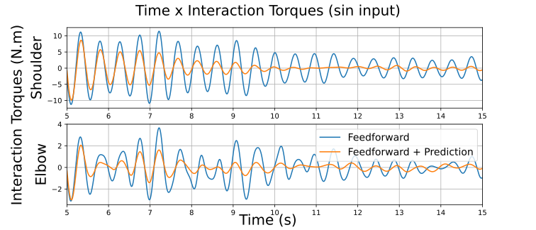

# MAn
The Motion Antecipation repository (MAn)

Example of result for Transparency Control using Motion Antecipation:



# Requirements

## General Requirements

### System-wide
* OpenGL
* Pthreads

To install the requirements:
```bash
sudo apt install libopengl-dev libglx-dev libgl1-mesa-dev libxrandr-dev libxinerama-dev libxcursor-dev libxi-dev
```

### Automatic Included Requirements
* MuJoCo (included through fetch)
* GLFW3 (included through fetch)
* Dear ImGui (included through fetch)

### Hardware Video Encoding Acceleration Requirements (TODO)
* FFMPEG dev libraries and headers
* CUDA compiler

To install the requirements: [IN DEVELOPMENT]
```bash
sudo apt install libavdevice-dev libavutils-dev
```

### Software Video Encoding Requirements
* OpenCV 4 or higher

To install the requirements:
```bash
sudo apt install libopencv-dev
```

# Build
To build use the ```build.sh``` script.

```bash
./build.sh
```

# Run
To run use the ```run.sh``` script.

```bash
./run.sh
```